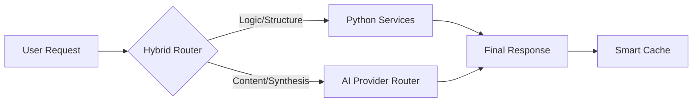

# 🌌 JYOMARG - Architecting Better Human Intelligence

[](https://fastapi.tiangolo.com/)
[](https://deepmind.google/technologies/gemini/)
[](https://www.python.org/)
[](https://jyomarg-1.onrender.com)
[](https://jyomarg-1.onrender.com)

**JYOMARG** (Sanskrit for "The Path of Mastery") is a production-grade, AI-powered career ecosystem designed to bridge the gap between academic learning and industry readiness. It utilizes a **Hybrid AI Architecture** that combines deterministic Python logic with Large Language Model (LLM) reasoning to provide a structured, reliable, and intelligent learning experience.

### 🌐 Live Application: [https://jyomarg-1.onrender.com](https://jyomarg-1.onrender.com)

---

## 🏗️ Technical Architecture: The Hybrid Edge

Unlike traditional AI applications that rely solely on LLM outputs (which can be hallucinated or unstructured), JYOMARG operates on a **Dual-Layer Intelligence System**:

1.  **Deterministic Layer (Python Engine)**: Manages structural integrity, mathematical scoring (ATS), database orchestration, and data validation using **Pydantic**. It enforces rigid rules like phase numbering, week counts, and skill matching percentages.
2.  **Creative Layer (LLM Reasoning)**: Uses **Google Gemini 1.5 Flash/Pro** (with Ollama fallback) for high-level synthesis, generating detailed lesson content, career advice, and resume optimization suggestions.

### **System Flow**


---

## 🚀 Core Ecosystem Modules

### **1. 🤖 ABHI (Architecting Better Human Intelligence)**
Your central career AI assistant. Featuring a **decentralized chat service**, ABHI can route queries between local logic (for FAQs/status) and the LLM (for complex career strategy).

### **2. 🗺️ Career Architect (Precision Roadmapping)**
Generates high-precision career paths.
- **Phase-Day Mapping**: Python enforces a global day-numbering system across all phases so learning never overlaps.
- **Domain Specificity**: Tailors roadmaps to specific roles like *Data Analyst*, *React Frontend*, or *Fullstack Engineer*.

### **3. 📚 LEARN Academy (AI Courses)**
- **Syllabus Generation**: Dynamic curriculum creation with weekly assessments.
- **Assessment Engine**: Automated MCQs and "Unlock" mechanics.
- **Lesson Formatter**: Converts AI JSON payloads into professional, high-density Markdown lessons.

### **4. 📄 Hybrid ATS & Resume Optimizer**
- **Deterministic Matcher**: Compares Resume tokens against Job Descriptions using frequency analysis and semantic intent.
- **Gap Analysis**: Generates a color-coded "Missing Skills" report.
- **ATS Checker**: Calculates a "Human-Verified" score based on experience weightage and skill density.

### **5. 🔔 Notification Hub (Intelligent Job Monitoring)**
- **Profile Matching**: Automatically scans your active resume and personal profile to suggest "Today's Jobs."
- **Auto-Cleanup**: Efficiently manages storage by pruning alerts older than 5 days.

---

## 🛠️ Technology Stack

| Category | Tools & Technologies |
| :--- | :--- |
| **Backend** | Python 3.10+, FastAPI, Uvicorn, Python-Multipart |
| **AI Engine** | Google Gemini API (Flash/Pro), Provider Abstraction Layer |
| **Data Processing** | Pydantic (Validation), PyPDF2 (Resume Parsing), Regular Expressions |
| **Database** | SQLite (Development), PostgreSQL (Production/Render) |
| **Security** | SessionMiddleware, ItsDangerous, ENV Encryption |
| **Frontend** | Jinja2 Templates, Vanilla CSS (Glassmorphism), JavaScript (Anime.js, Marked.js) |

---

## 🎨 Futuristic Design System
JYOMARG features a **"Deep Space Cyberpunk"** aesthetic:
- **Glassmorphism**: Translucent UI components for a modern, airy feel.
- **Neon Accents**: Active states and high-priority alerts use glowing neon tokens.
- **Responsive Animations**: Smooth transitions powered by Anime.js for an "ALIVE" interface.

---

## 💻 Developer Installation

1.  **Clone & Enter**
    ```bash
    git clone https://github.com/AbhilashNelapati/JYOMARG.git
    cd JYOMARG
    ```

2.  **Environment Setup**
    ```bash
    python -m venv .venv
    source .venv/bin/activate  # Windows: .venv\Scripts\activate
    pip install -r requirements.txt
    ```

3.  **API Configuration**
    Create a `.env` file:
    ```env
    GOOGLE_API_KEY=your_gemini_key
    SECRET_KEY=your_session_secret
    PORT=9000
    ```

4.  **Launch**
    ```bash
    python app.py
    ```

---

## 🔮 Roadmap & Future Scope
- **[ ] AI Mock Interviews**: Voice-integrated technical and HR mock rounds.
- **[ ] Email Job Synthesis**: Automated reports sent to users' inboxes periodically.
- **[ ] Community Roadmaps**: User-shared learning paths with rating systems.
- **[ ] Hybrid Mobile App**: Cross-platform mobile presence using PWA/Native tech.

---

## 📄 License & Ownership
Copyright © 2026 **Abhilash Nelapati**. 
Built with a vision to revolutionize career architecture through intelligence and structure. 🌌
